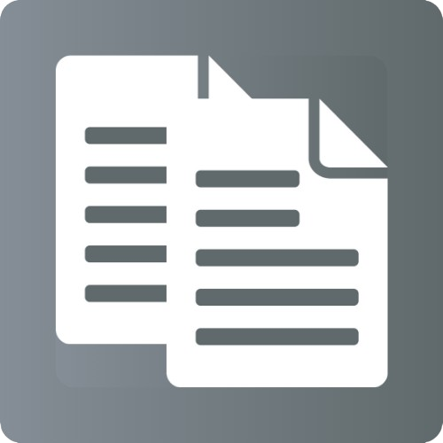

<!-- PROJECT SHIELDS -->
<!--
*** I'm using markdown "reference style" links for readability.
*** Reference links are enclosed in brackets [ ] instead of parentheses ( ).
*** See the bottom of this document for the declaration of the reference variables
*** for contributors-url, forks-url, etc. This is an optional, concise syntax you may use.
*** https://www.markdownguide.org/basic-syntax/#reference-style-links
-->

[![Contributors][contributors-shield]][contributors-url]
[![Forks][forks-shield]][forks-url]
[![Stargazers][stars-shield]][stars-url]
[![Issues][issues-shield]][issues-url]
[![MIT License][license-shield]][license-url]

<!-- PROJECT LOGO -->
 

  <a href="https://github.com/UzziKyle/PDFMergeXpress">
    
    <h3 align="center" style="color: black;">FilePartner</h3>
  </a>

  

    A handy tool to help busy humans with their document problems.
     
    <a href="https://github.com/UzziKyle/PDFMergeXpress/tree/docs/_index.md"><strong>Explore the docs »</strong></a>
     
     
    <a href="https://github.com/UzziKyle/PDFMergeXpress">View Demo</a>
    ·
    <a href="https://github.com/UzziKyle/PDFMergeXpress/issues">Report Bug</a>
    ·
    <a href="https://github.com/UzziKyle/PDFMergeXpress/issues">Request Feature</a>
  

<!-- TABLE OF CONTENTS -->

  
Table of Contents

  <ol>
    <li>
      <a href="#about-the-project">About The Project</a>
      <ul>
        <li><a href="#built-with">Built With</a></li>
      </ul>
    </li>
    <li>
      <a href="#getting-started">Getting Started</a>
      <ul>
        <li><a href="#prerequisites">Prerequisites</a></li>
        <li><a href="#installation">Installation</a></li>
      </ul>
    </li>
    <li><a href="#usage">Usage</a></li>
    <li><a href="#roadmap">Roadmap</a></li>
    <li><a href="#contributing">Contributing</a></li>
    <li><a href="#license">License</a></li>
    <li><a href="#contact">Contact</a></li>
    <li><a href="#acknowledgments">Acknowledgments</a></li>
  </ol>

<!-- ABOUT THE PROJECT -->

## About The Project

![Product Name Screen Shot][product-screenshot]

Currently, **FilePartner** is an app that lets you merge multiple PDFs at once, from the root directory to its deepest sub-directories.

It was originally made to solve the problem of merging numerous PDF files during the accreditation process at Palawan State University. No optimal solution was found on the internet, hence this project was commenced.

The project has already had its first version and successfully helped school staff. It is now in the phase of adding more useful features.

(<a href="#readme-top">back to top</a>)

### Built With

[![Python][python]][python_url]
[![CustomTkinter][customtkinter]][customtkinter_url]

(<a href="#readme-top">back to top</a>)

<!-- GETTING STARTED -->

## Getting Started

### Installation

1. Download the latest version [here](https://github.com/UzziKyle/PDFMergeXpress/releases/tag/v1.0.0).
2. Run the installer and follow everything through.
3. Enjoy using **FilePartner**!

(<a href="#readme-top">back to top</a>)

<!-- USAGE EXAMPLES -->

## Usage

To be updated.

(<a href="#readme-top">back to top</a>)

<!-- ROADMAP -->

## Roadmap

- [x] **New appearance**
  - [x] Change of name
  - [ ] Typography
  - [x] Color palette
  - [x] Custom logo
- [ ] **Docx to PDF converter**
  - [ ] Individual file
  - [ ] Bulk files
- [ ] **Image to PDF converter**
- [ ] **Documentations**

See the [open issues](https://github.com/UzziKyle/PDFMergeXpress/issues) for a full list of proposed features (and known issues).

(<a href="#readme-top">back to top</a>)

<!-- CONTRIBUTING -->

## Contributing

<!-- To be changed - uzzi -->

Contributions are what make the open source community such an amazing place to learn, inspire, and create. Any contributions you make are **greatly appreciated**.

If you have a suggestion that would make this better, please fork the repo and create a pull request. You can also simply open an issue with the tag "enhancement".
Don't forget to give the project a star! Thanks again!

1. Fork the Project
2. Create your Feature Branch (`git checkout -b feature/AmazingFeature`)
3. Commit your Changes (`git commit -m 'Add some AmazingFeature'`)
4. Push to the Branch (`git push origin feature/AmazingFeature`)
5. Open a Pull Request

(<a href="#readme-top">back to top</a>)

<!-- LICENSE -->

## License

Distributed under the MIT License. See `LICENSE.txt` for more information.

(<a href="#readme-top">back to top</a>)

<!-- ACKNOWLEDGMENTS -->

## Acknowledgments

- [CustomTkinter]([customtkinter_url]) by [TomSchimansky](https://github.com/TomSchimansky)

(<a href="#readme-top">back to top</a>)

<!-- MARKDOWN LINKS & IMAGES -->
<!-- https://www.markdownguide.org/basic-syntax/#reference-style-links -->

[contributors-shield]: https://img.shields.io/github/contributors/UzziKyle/PDFMergeXpress.svg?style=for-the-badge
[contributors-url]: https://github.com/UzziKyle/PDFMergeXpress/graphs/contributors
[forks-shield]: https://img.shields.io/github/forks/UzziKyle/PDFMergeXpress.svg?style=for-the-badge
[forks-url]: https://github.com/UzziKyle/PDFMergeXpress/network/members
[stars-shield]: https://img.shields.io/github/stars/UzziKyle/PDFMergeXpress.svg?style=for-the-badge
[stars-url]: https://github.com/UzziKyle/PDFMergeXpress/stargazers
[issues-shield]: https://img.shields.io/github/issues/UzziKyle/PDFMergeXpress.svg?style=for-the-badge
[issues-url]: https://github.com/UzziKyle/PDFMergeXpress/issues
[license-shield]: https://img.shields.io/github/license/UzziKyle/PDFMergeXpress.svg?style=for-the-badge
[license-url]: https://github.com/UzziKyle/PDFMergeXpress/blob/master/LICENSE.txt
[product-screenshot]: docs/assets/img/product_screenshot.png
[python]: https://img.shields.io/badge/python-000000?style=for-the-badge&logo=python&logoColor=white
[python_url]: https://www.python.org/
[customtkinter]: https://img.shields.io/badge/customtkinter-blue?style=for-the-badge
[customtkinter_url]: https://github.com/TomSchimansky/CustomTkinter
